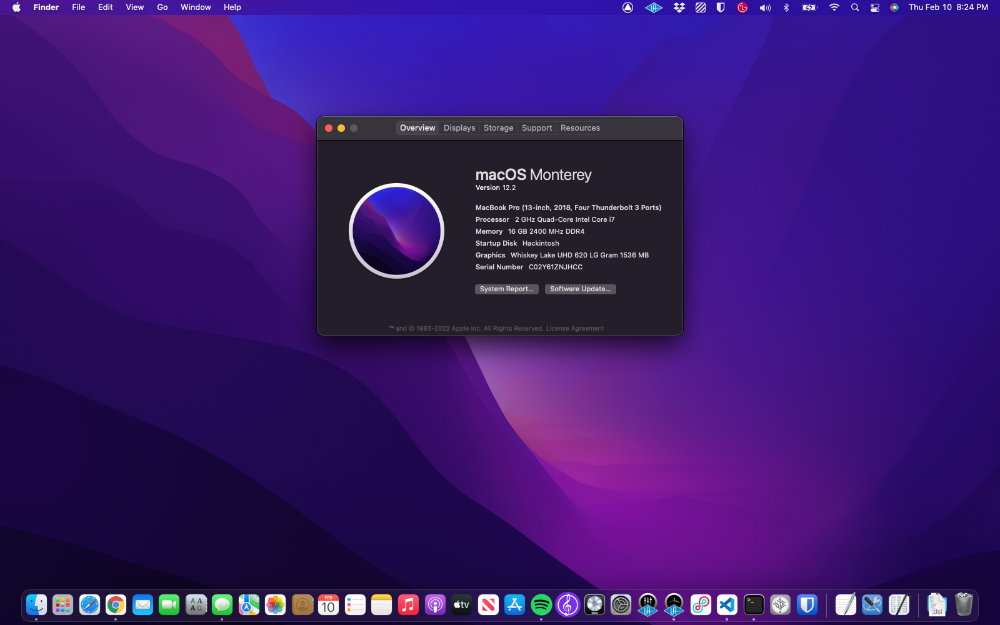

# LG-Gram-17z990-Hackintosh
An (almost) perfect Hackintosh build for the LG Gram 17z990 using OpenCore.

## Introduction
This is the result of many hours of work, scouring the internet for random forum posts and reading countless guides. I would call this build very stable. The only remaining improvements to be made would require extensive development, namely from the OpenIntelWireless team. I will try to keep this Readme up to date if anything changes.

## Specs
- **MacOS Version**: 12.2 (Monterey)
- **CPU**: Intel i7-8565U (Whiskey Lake)
- **GPU**: Intel UHD 620
- **RAM**: 16 GB
- **Thunberbolt Chipset**: JHL6340 (Alpine Ridge)
- **Audio**: Conexant Smartaudio HD

## Instructions

### 1. BIOS

#### Update

LG annoyingly does not provide standalone driver downloads for this laptop. You must download the [LG Update Center](https://gscs-b2c.lge.com/downloadFile?fileId=NvUWILGW2KOlkZQCAYJBg) and update the BIOS from there. I would recommend updating to the latest BIOS as that is what I have tested this configuration on.

#### Get Into BIOS Advanced Menu

- Hold F2 to enter BIOS on boot up
- Press Ctrl-Alt-F7 to open Advanced Options

#### Settings
- Main
    - Boot Features
        - Quick Boot => *Disabled*
- Advanced
    - SW Guard Extensions (SGX) => *Disabled*
    - Intel Advanced Menu
        - CPU Configuration
            - Software Guard Extensions (SGX) => *Disabled* (Not Sure why it has two setting locations)
        - Power & Performance
            - CPU - Power Management Control
                - CPU Lock Configuration
                    - CFG Lock => *Disabled*
                    - Overclocking Lock => *Disabled*
        - System Agent (SA) Configuration
            - Graphics Configuration
                - DVMT Pre-Allocated => *64M*
        - PCH-IO Configuration
            - Security Configuration
                - Force unlock on all GPIO pads => *Enabled* (Thanks 1OldSWguy)
        - Platform Settings
            - System Time and Alarm Source => *Legacy RTC*
        - Thunderbolt Configuration
            - Thunderbolt Boot Support => *Pre-Boot ACL*
            - Security Level => *No Security*

#### Exit
- Press F10
- Yes to exit saving changes
- **NOTE**: Any time the system shuts off unexpectedly or the kernel panics, the settings will be reset, and you must re-enter these settings.

### 2. Generate SMBIOS
- https://github.com/corpnewt/GenSMBIOS
- MacbookPro15,2
- Follow Guide to Add to config.plist - https://dortania.github.io/OpenCore-Install-Guide/config-laptop.plist/coffee-lake.html#platforminfo

### 3. Boot Installer
- Boot OpenCore, select installer, and Install Monterey. (You'll have to Create a MacOS Monterey installer - https://dortania.github.io/OpenCore-Install-Guide/installer-guide/)

### 4. Post-Install
- Install LGGramAssistant
- Disable Force Touch

## What Works
- The touchpad works normally. Note that force touch must be disabled in System Preferences
- Keyboard functions normally
- Fn keys are functional, using a combination of SSDT patches, builtin ACPI functionality, and a helper program called [LGGramAssistant](https://github.com/lehrian/LGgramAssistant). It's possible to map other ones, but I'm lazy, so currently the ones that are mapped are:
    - **Fn+F2**: Brightness down
    - **Fn+F3**: Brightness up
    - **Fn+F4**: Sleep
    - **Fn+F6**: Toggle WiFi
    - **Fn+LShift+F6**: Toggle Bluetooth
    - **Fn+F8**: Toggle Keyboard Backlight
    - **Fn+F10**: Mute
    - **Fn+F11**: Volume Down
    - **Fn+F12**: Volume Up
- The display works with graphics acceleration
- Sleep/wake works, including closing the laptop lid to sleep
- WiFi/Bluetooth works natively (no need for an add-in card)
- The 3 USB Type A ports work both in USB3 and USB2 modes
- The USB Type C port works in every possible way:
    - Thunderbolt 3 works, including hotplug, even after sleep
    - USB3/USB2 works, including hotplug, even after sleep
    - Works regardless of whether or not a device was plugged in at boot
- HDMI output works
- MicroSD Card reader works
- Audio works, including the headphone jack (have not tested audio in through the headphone jack)
- Battery reports percentage correctly
- Power management seems to work correctly
- Dual booting with Windows works fine, including using Boot Camp and Target Disk mode
- FileVault and Secure Boot are working
- Both SATA and NVMe M.2 drives seem to work fine

## What Doesn't Work
- AirDrop/Wireless Sidecar/Various other Apple Continuity things
    - This is a limitation of the OpenIntelWireless drivers
    - Only Handoff and Universal Clipboard are supported
- Hibernation (S4 sleep)
    - This is not supported at all for Hackintoshes as far as I know
- Trackpad doesn't function in the OpenCore boot picker
- Boot Chime (Don't really care enough to work on this)

## Thanks
- Suzuke's [build for the 13z980](https://github.com/suzuke/LG-Gram-13z980-Opencore) was an invaluable starting point
- AskDavis's [build for the 17z90n](https://github.com/AskDavis/LG-Gram-17Z90N)
- Parthvsquare's [build for the 14z980](https://github.com/Parthvsquare/Opencore-LG-gram-14z980)
- EliteMacX86 for the [Thunderbolt 3 hotplug information](https://elitemacx86.com/threads/how-to-enable-thunderbolt-3-hotplug-on-macos.462/)
- The whole [Acidanthera team](https://github.com/acidanthera)!
- Many random forum posters
